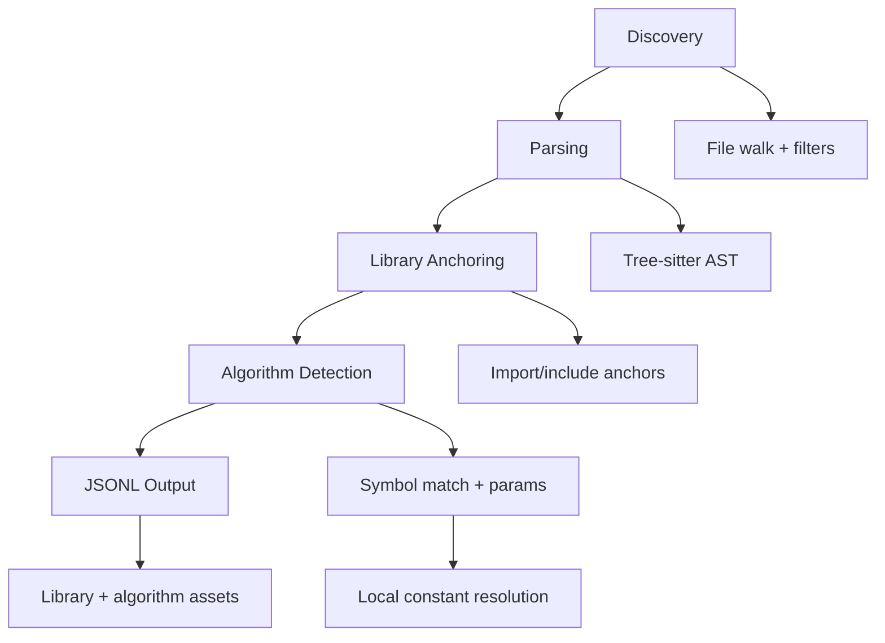

# Cipherscope Architecture

## Overview
Cipherscope is a static analysis scanner designed to build a cryptographic inventory. It parses source files using Tree-sitter, matches library anchors and algorithm symbols, and emits JSONL findings that can be aggregated into an inventory.

## Pipeline


## Data Model
- Library hit: name, file path, evidence location.
- Algorithm hit: name, file path, evidence location, metadata (e.g., key size, primitive).
- Output format is designed for tooling pipelines and inventory aggregation.

### JSONL Schema (Informal)
```json
{
  "assetType": "library|algorithm",
  "identifier": "string",
  "path": "string",
  "evidence": {
    "line": 1,
    "column": 1
  },
  "metadata": {
    "primitive": "string",
    "keySize": 256
  }
}
```

## Dedupe Policy
To reduce overcounting on a single callsite, Cipherscope applies a simple same-line dedupe rule after matching:
- If two algorithms share the same `primitive` and line, drop the generic identifier when a more specific variant is present.
- A more specific identifier is one that either:
  - starts with the generic identifier plus a `-` (e.g., `AES-GCM` over `AES`), or
  - shares the same non-numeric tokens but adds numeric detail (e.g., `ECDSA-P256` over `ECDSA`).
- Different primitives on the same line are kept.

## Patterns and Extensibility
Patterns live in `patterns.toml`:
- Libraries define anchors and API regexes.
- Algorithms define symbol patterns and parameter extraction rules.
Adding a new library or algorithm usually only requires editing `patterns.toml`.

## Scope and Limits
- Inventory-first: it focuses on discovering crypto usage and relevant metadata.
- Local constant resolution only; cross-file or full data-flow analysis is out of scope for now.
