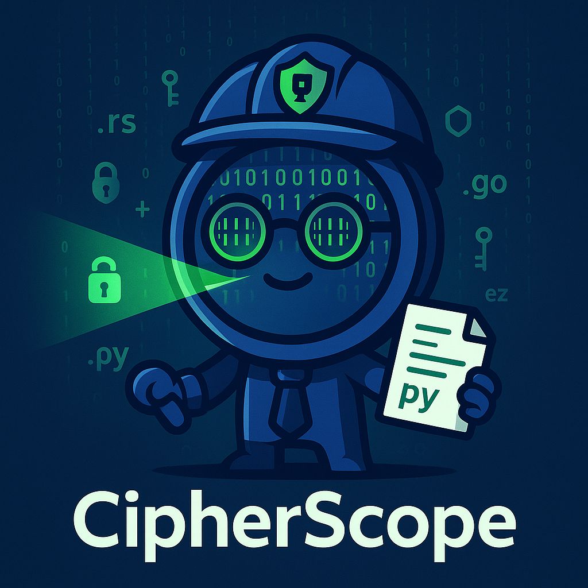

# CipherScope

<div align="center">
  
</div>

Fast cryptographic inventory generator. Scans codebases to identify cryptographic algorithms and assess quantum resistance.

## Quick Start

```bash
cargo build --release
./target/release/cipherscope /path/to/scan
```

## What It Does

- **Detects** cryptographic usage across 11 languages
- **Identifies** many cryptographic algorithms (AES, SHA, RSA, ECDSA, ChaCha20, etc.)
- **Outputs** JSON inventory with NIST quantum security levels
- **Runs fast** - GiB/s throughput with parallel scanning

## Example Output

```json
{
  "bomFormat": "MV-CBOM",
  "specVersion": "1.0",
  "cryptoAssets": [{
    "name": "RSA",
    "assetProperties": {
      "primitive": "signature",
      "parameterSet": {"keySize": 2048},
      "nistQuantumSecurityLevel": 0
    }
  }]
}
```

## Options

- `--patterns PATH` - Custom patterns file (default: `patterns.toml`)
- `--progress` - Show progress bar
- `--deterministic` - Reproducible output for testing

## Languages Supported

C, C++, Go, Java, Kotlin, Python, Rust, Swift, Objective-C, PHP, Erlang

## Configuration

Edit `patterns.toml` to add new libraries or algorithms. No code changes needed.

## Testing

```bash
cargo test
```

## License

MIT